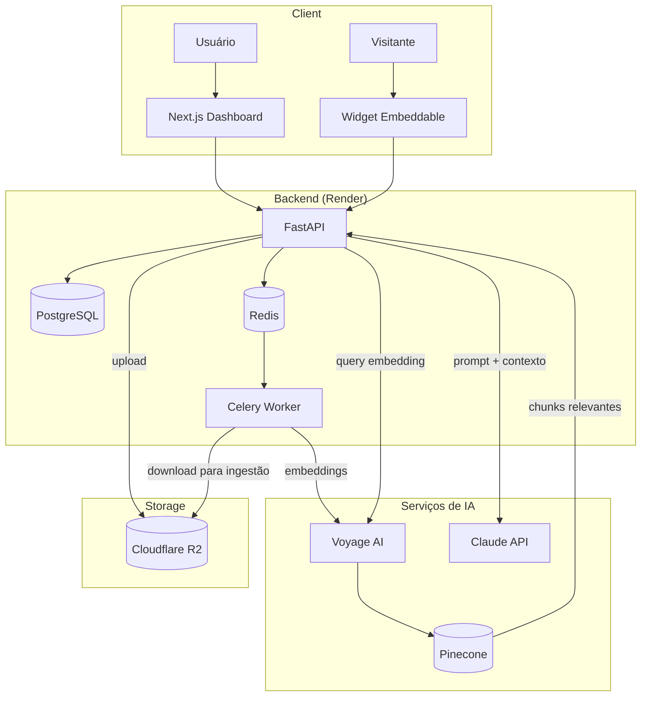

# NexusAI

> Multi-tenant SaaS RAG chatbot — transforme qualquer documento em uma base de conhecimento conversacional.

[](https://python.org)
[](https://fastapi.tiangolo.com)
[](https://nextjs.org)
[](LICENSE)

---

## Funcionalidades

- **Multi-tenancy completo** — cada empresa tem seu slug, usuários e dados isolados
- **Ingestão de documentos** — upload PDF/TXT → chunking automático → embeddings → Pinecone
- **RAG pipeline** — recuperação semântica + geração com Claude (Anthropic)
- **Widget embeddable** — chatbot embutível em qualquer site com uma linha de HTML
- **Auth JWT** — access token (30 min) + refresh token httpOnly (7 dias)
- **Dashboard** — gerenciamento de documentos e histórico de conversas

---

## Arquitetura



**Fluxo de ingestão:** Upload → FastAPI salva no R2 → enfileira task Celery → Worker extrai texto → Voyage AI gera embeddings → indexa no Pinecone → salva Chunks no PostgreSQL

**Fluxo de chat:** Pergunta → embedding da query → busca no Pinecone → monta prompt com contexto → Claude gera resposta

---

## Setup local

### Pré-requisitos

- Docker Desktop 4.x+
- Chaves de API: Anthropic, Pinecone, Voyage AI
- (Opcional para upload em prod) Conta Cloudflare R2

### 1. Clone e configure variáveis de ambiente

```bash
git clone https://github.com/PlinioFdev/nexusai.git
cd nexusai
cp .env.example .env
```

Edite o `.env` com suas chaves (ver tabela de variáveis abaixo).

### 2. Suba os containers

```bash
docker compose up -d
```

### 3. Acesse

| Serviço | URL |
|---|---|
| Frontend | http://localhost:3000 |
| Backend API | http://localhost:8001 |
| Docs interativos | http://localhost:8001/docs |

### `.env.example`

```dotenv
# Docker / PostgreSQL
POSTGRES_USER=nexusai
POSTGRES_PASSWORD=nexusai
POSTGRES_DB=nexusai

# Backend
ENVIRONMENT=development
DATABASE_URL=postgresql://nexusai:nexusai@db:5432/nexusai
REDIS_URL=redis://redis:6379/0
SECRET_KEY=troque-por-secrets.token_hex(32)

# CORS — adicionar origens separadas por vírgula em produção
BACKEND_CORS_ORIGINS=["http://localhost:3000"]

# Anthropic
ANTHROPIC_API_KEY=sk-ant-...

# Pinecone
PINECONE_API_KEY=...
PINECONE_INDEX_NAME=nexusai

# Voyage AI
VOYAGE_API_KEY=pa-...

# Storage R2 — deixar em branco em dev (usa volume local)
AWS_ACCESS_KEY_ID=
AWS_SECRET_ACCESS_KEY=
AWS_BUCKET_NAME=nexusai-uploads
AWS_ENDPOINT_URL=
AWS_REGION=auto
```

---

## Widget embeddable

Adicione o chatbot a qualquer site com uma única linha:

```html
<script
  src="https://nexusai-gules-nine.vercel.app/widget/embed.js"
  data-api-key="sua-api-key-do-tenant"
  data-base-url="https://nexusai-api-s5m9.onrender.com"
></script>
```

Para obter a `api-key` do seu tenant, acesse o dashboard em **Configurações → API Key**.

> **Nota:** `document.currentScript` é capturado sincronamente no topo de `embed.js`. Não adicione `async` ou `defer` à tag `<script>` — isso anula a captura da referência.

---

## Variáveis de ambiente

| Variável | Obrigatória | Default | Descrição |
|---|---|---|---|
| `ENVIRONMENT` | sim | `development` | `development` ou `production` |
| `DATABASE_URL` | sim | — | Connection string PostgreSQL |
| `REDIS_URL` | sim | `redis://redis:6379/0` | Connection string Redis |
| `SECRET_KEY` | sim | — | Chave JWT — gerar com `secrets.token_hex(32)` |
| `BACKEND_CORS_ORIGINS` | sim | `[]` | Lista JSON de origens permitidas |
| `ANTHROPIC_API_KEY` | sim | — | Chave da API Anthropic |
| `CLAUDE_MODEL` | não | `claude-sonnet-4-20250514` | Modelo Claude |
| `PINECONE_API_KEY` | sim | — | Chave da API Pinecone |
| `PINECONE_INDEX_NAME` | não | `nexusai` | Nome do índice Pinecone |
| `VOYAGE_API_KEY` | sim | — | Chave da API Voyage AI |
| `AWS_ACCESS_KEY_ID` | prod | — | Access Key ID do R2/S3 |
| `AWS_SECRET_ACCESS_KEY` | prod | — | Secret Access Key do R2/S3 |
| `AWS_BUCKET_NAME` | prod | `nexusai-uploads` | Nome do bucket |
| `AWS_ENDPOINT_URL` | prod (R2) | — | `https://<account-id>.r2.cloudflarestorage.com` |
| `AWS_REGION` | não | `auto` | Região (usar `auto` para R2) |

---

## Deploy

### Render (Backend + Worker)

O repositório inclui `render.yaml` com a definição dos dois serviços.

**1. Criar recursos gerenciados no dashboard Render**

Antes de fazer o deploy, crie manualmente:
- **PostgreSQL** → New → PostgreSQL → nome: `nexusai-db` → plano Free
- **Redis** → New → Redis → nome: `nexusai-redis` → plano Free

Anote as **Internal URLs** geradas (usadas como `DATABASE_URL` e `REDIS_URL`).

**2. Deploy via Blueprint**
New → Blueprint → conectar repositório → Render detecta render.yaml automaticamente

**3. Configurar variáveis de ambiente**

No dashboard de cada serviço (`nexusai-api` e `nexusai-worker`), adicionar em **Environment**:
DATABASE_URL        = <internal URL do PostgreSQL>
REDIS_URL           = <internal URL do Redis>
SECRET_KEY          = <secrets.token_hex(32)> — mesmo valor nos dois serviços
ANTHROPIC_API_KEY   = sk-ant-...
PINECONE_API_KEY    = ...
VOYAGE_API_KEY      = pa-...
AWS_ACCESS_KEY_ID   = ...
AWS_SECRET_ACCESS_KEY = ...
AWS_ENDPOINT_URL    = https://<account-id>.r2.cloudflarestorage.com
BACKEND_CORS_ORIGINS = ["https://nexusai-gules-nine.vercel.app"]

> **Atenção:** `SECRET_KEY` deve ser **idêntico** em `nexusai-api` e `nexusai-worker` — ambos precisam assinar e verificar os mesmos tokens.

A migration `alembic upgrade head` roda automaticamente no startup do `nexusai-api`.

---

### Vercel (Frontend)

**1. Importar projeto**
New Project → Import Git Repository → selecionar nexusai → Root Directory: frontend

**2. Configurar variável de ambiente**
NEXT_PUBLIC_API_URL = https://nexusai-api-s5m9.onrender.com

**3. Deploy**

Vercel detecta Next.js automaticamente. Clique em **Deploy**.

---

## Dívidas técnicas conhecidas

| # | Local | Descrição |
|---|---|---|
| 1 | `models/chat.py` | Sem índice em `(session_id, created_at)` — `_get_recent_history` ordena em Python |
| 2 | `models/chunk.py` | `tenant_id: String` sem tamanho explícito |
| 3 | `endpoints/documents.py` + `tasks/ingest.py` | `_get_pinecone_index()` duplicada |
| 4 | `schemas/chat.py` | `ChatSessionResponse` expõe `user_id` — desnecessário para o cliente |
| 5 | `widget/embed.ts` | `document.currentScript` é `null` com `async`/`defer` — não adicionar esses atributos |

---

## Testes

```bash
# Backend
docker compose exec backend pytest -v

# Frontend
docker compose exec frontend npm test
```

**Cobertura atual:** 51 testes backend + 35 testes frontend = 86 testes
